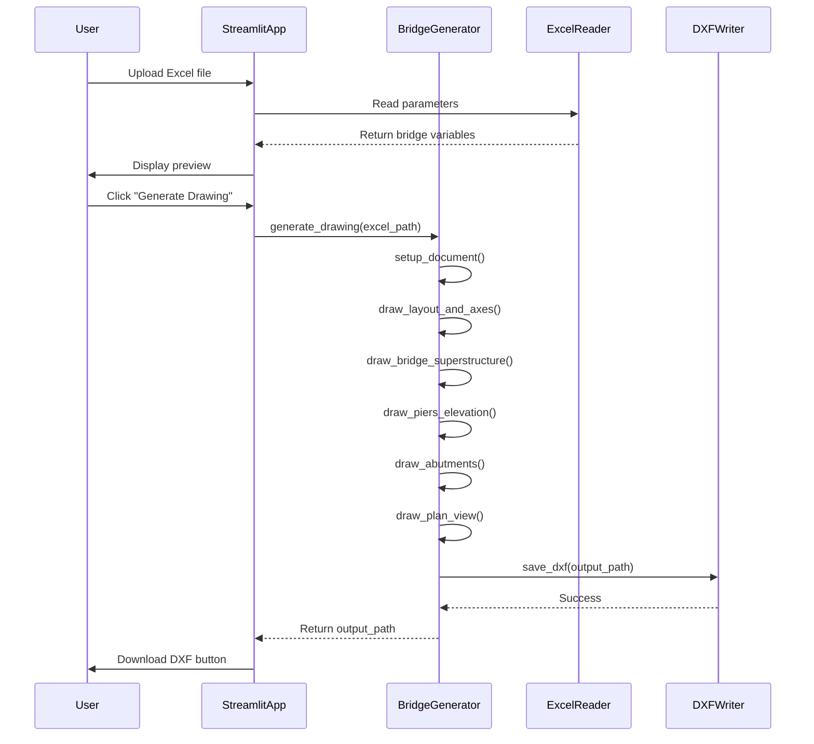
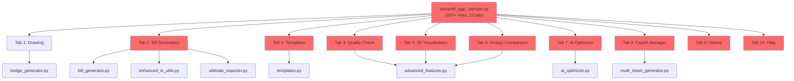
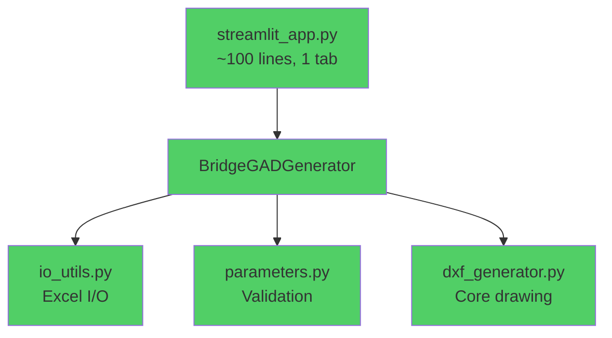
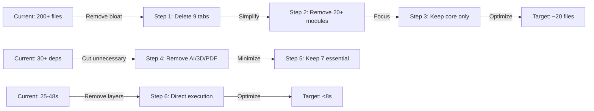

# Design Document: BridgeCanvas Transformation

## Overview

Transform the bloated Bridge_GAD_Yogendra_Borse root application (200+ files, 30+ dependencies, 10 tabs) into a lean, focused BridgeCanvas application (<20 files, 7 dependencies, 1 tab) following the principle of "do one thing perfectly." The transformation eliminates feature creep, removes unnecessary abstractions, and focuses exclusively on the core functionality: uploading Excel bridge parameters and generating professional AutoCAD DXF drawings. Target performance improvement from 25-48 seconds to <8 seconds total processing time, achieving 100% test success rate (7/7 inputs).

## Main Algorithm/Workflow



## Architecture

### Current State (Bloated - 200+ files)




### Target State (Lean - ~20 files)



### Transformation Strategy



## Components and Interfaces

### Component 1: StreamlitApp (streamlit_app.py)

**Purpose**: Minimal UI for file upload, preview, and download

**Interface**:
```python
# Main application entry point
def main():
    """Single-tab Streamlit application for bridge drawing generation."""
    pass

# No class needed - functional approach
```

**Responsibilities**:
- File upload handling (st.file_uploader)
- Data preview (pandas DataFrame display)
- Generate button and progress indicator
- Download button for DXF output
- Minimal error handling and user feedback

**Key Features**:
- Single tab only (no navigation complexity)
- ~100 lines total (vs 1000+ currently)
- No session state management
- No history tracking
- Direct workflow: Upload → Preview → Generate → Download

### Component 2: BridgeGADGenerator (bridge_generator.py)

**Purpose**: Core engine for generating bridge drawings

**Interface**:
```python
class BridgeGADGenerator:
    def __init__(self, acad_version: str = "R2010"):
        """Initialize generator with AutoCAD version."""
        pass
    
    def generate_drawing(self, excel_path: Path, output_path: Path) -> bool:
        """Main entry point - generate complete drawing from Excel."""
        pass
    
    # Internal methods (private)
    def _setup_document(self) -> None:
        """Initialize DXF document."""
        pass
    
    def _read_parameters(self, excel_path: Path) -> Dict[str, float]:
        """Read and validate bridge parameters."""
        pass
    
    def _draw_layout(self) -> None:
        """Draw axes and grid."""
        pass
    
    def _draw_superstructure(self) -> None:
        """Draw deck and approach slabs."""
        pass
    
    def _draw_piers(self) -> None:
        """Draw piers in elevation."""
        pass
    
    def _draw_abutments(self) -> None:
        """Draw abutments."""
        pass
    
    def _draw_plan_view(self) -> None:
        """Draw plan view."""
        pass
    
    def _save_dxf(self, output_path: Path) -> None:
        """Save DXF file."""
        pass
```

**Responsibilities**:
- DXF document creation and management
- Coordinate transformation (real-world to drawing)
- Drawing all bridge components
- Handling skew angles and geometric calculations
- File output

**Simplifications from Current**:
- Remove multi-format export (DXF only)
- Remove validation layers (basic checks only)
- Remove abstraction layers (direct ezdxf calls)
- Remove logging verbosity (errors only)
- No telemetry or analytics


### Component 3: IOUtils (io_utils.py)

**Purpose**: Simple Excel reading and basic validation

**Interface**:
```python
def read_bridge_parameters(excel_path: Path) -> Dict[str, float]:
    """Read bridge parameters from Excel file.
    
    Expected format: 3 columns (Value, Variable, Description)
    Returns: Dictionary mapping variable names to values
    """
    pass

def validate_parameters(params: Dict[str, float]) -> Tuple[bool, str]:
    """Basic validation of required parameters.
    
    Returns: (is_valid, error_message)
    """
    pass
```

**Responsibilities**:
- Read Excel files (openpyxl)
- Parse 3-column format (Value, Variable, Description)
- Basic validation (required fields present, numeric values)
- Return clean dictionary

**Simplifications**:
- No smart format detection (standard 3-column only)
- No multi-sheet support
- No format conversion
- No enhanced error recovery

### Component 4: Parameters (parameters.py)

**Purpose**: Parameter definitions and defaults

**Interface**:
```python
# Required parameters
REQUIRED_PARAMS = [
    'NSPAN', 'SPAN1', 'ABTL', 'RTL', 'DATUM',
    'LEFT', 'RIGHT', 'SCALE1', 'SCALE2'
]

# Default values
DEFAULT_PARAMS = {
    'SKEW': 0.0,
    'SCALE1': 186.0,
    'SCALE2': 100.0,
    # ... other defaults
}

def get_parameter(params: Dict, key: str, default: float = None) -> float:
    """Get parameter with fallback to default."""
    pass
```

**Responsibilities**:
- Define required parameters
- Provide default values
- Parameter access with fallbacks

**Simplifications**:
- No complex validation rules
- No parameter relationships checking
- No units conversion

## Data Models

### BridgeParameters

```python
# Simple dictionary structure (no Pydantic)
BridgeParameters = Dict[str, float]

# Example:
{
    'NSPAN': 3.0,           # Number of spans
    'SPAN1': 12.0,          # Span length (m)
    'ABTL': 0.0,            # Left abutment location
    'RTL': 110.98,          # Road top level
    'DATUM': 100.0,         # Datum level
    'LEFT': 0.0,            # Left extent
    'RIGHT': 50.0,          # Right extent
    'SCALE1': 186.0,        # Horizontal scale numerator
    'SCALE2': 100.0,        # Horizontal scale denominator
    'SKEW': 0.0,            # Skew angle (degrees)
    'CCBR': 11.1,           # Clear carriageway width
    'CAPW': 1.2,            # Pier cap width
    'CAPT': 110.0,          # Pier cap top level
    'PIERTW': 1.2,          # Pier thickness
    'FUTW': 4.5,            # Footing width
    'FUTD': 1.0,            # Footing depth
    # ... ~50 total parameters
}
```

**Validation Rules**:
- All values must be numeric (float)
- NSPAN must be positive integer
- Span lengths must be positive
- Scale values must be positive
- Skew angle: -45° to +45°

### DrawingOutput

```python
# Simple path-based output (no complex structure)
DrawingOutput = Path  # Path to generated DXF file

# Example:
output = Path("bridge_drawing.dxf")
```

## Algorithmic Pseudocode

### Main Processing Algorithm

```pascal
ALGORITHM generateBridgeDrawing(excelPath, outputPath)
INPUT: excelPath of type Path, outputPath of type Path
OUTPUT: success of type boolean

BEGIN
  // Step 1: Read and validate parameters
  parameters ← readBridgeParameters(excelPath)
  ASSERT parameters IS NOT NULL
  
  isValid, errorMsg ← validateParameters(parameters)
  IF NOT isValid THEN
    DISPLAY errorMsg
    RETURN false
  END IF
  
  // Step 2: Initialize DXF document
  doc ← createDXFDocument("R2010")
  msp ← doc.modelspace()
  setupStyles(doc)
  
  // Step 3: Calculate derived values
  scale ← parameters['SCALE1'] / parameters['SCALE2']
  skewRad ← parameters['SKEW'] * π / 180
  sinSkew ← sin(skewRad)
  cosSkew ← cos(skewRad)
  
  // Step 4: Draw components in sequence
  drawLayoutAndAxes(msp, parameters, scale)
  drawBridgeSuperstructure(msp, parameters, scale)
  drawPiersElevation(msp, parameters, scale, skewRad)
  drawAbutments(msp, parameters, scale, skewRad)
  drawPlanView(msp, parameters, scale, skewRad)
  
  // Step 5: Save output
  doc.saveas(outputPath)
  
  RETURN true
END
```

**Preconditions:**
- excelPath exists and is readable
- excelPath contains valid Excel file with 3-column format
- outputPath directory exists and is writable
- All required parameters present in Excel file

**Postconditions:**
- DXF file created at outputPath
- File contains complete bridge drawing
- File is valid AutoCAD R2010 format
- All bridge components drawn correctly
- No side effects on input file

**Loop Invariants:** N/A (no loops in main algorithm)


### Coordinate Transformation Algorithm

```pascal
ALGORITHM transformCoordinates(realX, realY, datum, left, hScale, vScale)
INPUT: realX, realY, datum, left, hScale, vScale of type float
OUTPUT: drawingX, drawingY of type float

BEGIN
  // Horizontal transformation
  drawingX ← left + hScale * (realX - left)
  
  // Vertical transformation
  drawingY ← datum + vScale * (realY - datum)
  
  RETURN (drawingX, drawingY)
END
```

**Preconditions:**
- All input values are valid floats
- hScale > 0 and vScale > 0
- datum and left are reference points

**Postconditions:**
- Returns valid drawing coordinates
- Maintains proportional scaling
- No mutations to input parameters

**Loop Invariants:** N/A

### Pier Drawing Algorithm

```pascal
ALGORITHM drawPierElevation(msp, xCenter, parameters, scale, skewRad)
INPUT: msp (modelspace), xCenter, parameters, scale, skewRad
OUTPUT: None (draws to msp)

BEGIN
  // Extract parameters
  capWidth ← parameters['CAPW']
  capTop ← parameters['CAPT']
  capBottom ← parameters['CAPB']
  pierWidth ← parameters['PIERTW']
  batter ← parameters['BATTR']
  footingLevel ← parameters['FUTRL']
  footingDepth ← parameters['FUTD']
  footingWidth ← parameters['FUTW']
  
  // Adjust for skew
  capWidthAdj ← capWidth / cos(skewRad)
  pierWidthAdj ← pierWidth / cos(skewRad)
  footingWidthAdj ← footingWidth / cos(skewRad)
  
  // Calculate pier geometry
  pierHeight ← capBottom - footingLevel
  batterOffset ← pierHeight / batter
  
  // Draw pier cap
  x1 ← xCenter - capWidthAdj / 2
  x2 ← xCenter + capWidthAdj / 2
  y1 ← transformY(capTop)
  y2 ← transformY(capBottom)
  drawRectangle(msp, x1, y1, x2, y2)
  
  // Draw pier shaft with batter
  x3 ← x1 - batterOffset
  x4 ← x2 + batterOffset
  y3 ← transformY(footingLevel)
  drawTrapezoid(msp, x1, y2, x2, y2, x4, y3, x3, y3)
  
  // Draw footing
  x5 ← xCenter - footingWidthAdj / 2
  x6 ← xCenter + footingWidthAdj / 2
  y4 ← transformY(footingLevel - footingDepth)
  drawRectangle(msp, x5, y3, x6, y4)
END
```

**Preconditions:**
- msp is valid DXF modelspace
- xCenter is valid pier location
- All parameters are positive values
- skewRad is in range [-π/4, π/4]
- batter > 0 (to avoid division by zero)

**Postconditions:**
- Pier cap, shaft, and footing drawn to msp
- All components properly connected
- Skew angle applied correctly
- No overlapping geometry

**Loop Invariants:** N/A (no loops)

### Abutment Drawing Algorithm

```pascal
ALGORITHM drawAbutment(msp, xLocation, parameters, scale, skewRad, side)
INPUT: msp, xLocation, parameters, scale, skewRad, side (left/right)
OUTPUT: None (draws to msp)

BEGIN
  // Extract abutment parameters
  capWidth ← parameters['ALCW']  // or ARCW for right
  capDepth ← parameters['ALCD']  // or ARCD for right
  frontBatter ← parameters['ALFB']
  toeBatter ← parameters['ALTB']
  footingOffset ← parameters['ALFO']
  footingDepth ← parameters['ALFD']
  
  // Calculate abutment geometry
  capTop ← parameters['CAPT']
  capBottom ← capTop - capDepth
  
  // Adjust for side (left vs right)
  IF side = "right" THEN
    direction ← -1  // Mirror for right side
  ELSE
    direction ← 1
  END IF
  
  // Build abutment profile points
  points ← []
  
  // Cap section
  x1 ← xLocation
  x2 ← xLocation + direction * capWidth
  points.add((x1, capTop))
  points.add((x2, capTop))
  points.add((x2, capBottom))
  
  // Front batter section
  batterLength ← (capBottom - footingLevel) / frontBatter
  x3 ← x2 + direction * batterLength
  points.add((x3, footingLevel))
  
  // Toe section
  toeLength ← (footingLevel - toeLevel) / toeBatter
  x4 ← x3 + direction * toeLength
  points.add((x4, toeLevel))
  
  // Footing
  x5 ← x4 + direction * footingOffset
  points.add((x5, toeLevel))
  points.add((x5, toeLevel - footingDepth))
  
  // Back side (mirror)
  // ... add back side points
  
  // Draw closed polyline
  drawPolyline(msp, points, closed=true)
END
```

**Preconditions:**
- msp is valid DXF modelspace
- xLocation is valid abutment position
- All parameters are positive values
- side is either "left" or "right"
- Batter values > 0

**Postconditions:**
- Complete abutment profile drawn
- All sections properly connected
- Geometry is closed polyline
- Side-specific mirroring applied correctly

**Loop Invariants:** N/A (no loops)


### Plan View Drawing Algorithm

```pascal
ALGORITHM drawPlanView(msp, parameters, scale, skewRad)
INPUT: msp, parameters, scale, skewRad
OUTPUT: None (draws to msp)

BEGIN
  nSpans ← parameters['NSPAN']
  spanLength ← parameters['SPAN1']
  abutmentLeft ← parameters['ABTL']
  
  // Plan view Y-coordinate (below elevation)
  planY ← parameters['DATUM'] - 30.0
  
  // Draw pier footings in plan
  FOR i FROM 1 TO nSpans - 1 DO
    ASSERT i > 0 AND i < nSpans  // Loop invariant
    
    pierX ← abutmentLeft + i * spanLength
    
    // Get footing dimensions
    footingWidth ← parameters['FUTW']
    footingLength ← parameters['FUTL']
    
    // Adjust for skew
    footingWidthAdj ← footingWidth / cos(skewRad)
    footingLengthAdj ← footingLength / cos(skewRad)
    
    // Calculate skew offsets
    xOffset ← (footingLengthAdj / 2) * sin(skewRad)
    yOffset ← (footingLengthAdj / 2) * (1 - cos(skewRad))
    
    // Draw footing rectangle with skew
    x1 ← pierX - footingWidthAdj / 2
    x2 ← pierX + footingWidthAdj / 2
    y1 ← planY + footingLengthAdj / 2
    y2 ← planY - footingLengthAdj / 2
    
    points ← [
      (x1 - xOffset, y1 - yOffset),
      (x2 - xOffset, y1 - yOffset),
      (x2 + xOffset, y2 + yOffset),
      (x1 + xOffset, y2 + yOffset)
    ]
    
    drawPolyline(msp, points, closed=true)
    
    // Draw pier shaft in plan (smaller rectangle)
    pierWidth ← parameters['PIERTW']
    pierSpacing ← parameters['PIERST']
    
    // Similar skew adjustment for pier
    // ... draw pier rectangle
    
    // Add pier label
    addText(msp, "P" + i, pierX, y1 + 2.0)
  END FOR
  
  // Draw abutment footings
  drawAbutmentFootingPlan(msp, abutmentLeft, planY, parameters, skewRad, "A1")
  
  rightAbutmentX ← abutmentLeft + nSpans * spanLength
  drawAbutmentFootingPlan(msp, rightAbutmentX, planY, parameters, skewRad, "A2")
END
```

**Preconditions:**
- msp is valid DXF modelspace
- nSpans ≥ 1
- spanLength > 0
- All footing dimensions > 0
- skewRad in range [-π/4, π/4]

**Postconditions:**
- All pier footings drawn in plan view
- All abutment footings drawn
- Skew angle applied to all elements
- Labels added for all piers and abutments
- Plan view positioned below elevation view

**Loop Invariants:**
- For each iteration i: 0 < i < nSpans
- All previously drawn footings are valid and closed
- Pier positions are evenly spaced at spanLength intervals
- All skew transformations maintain geometric consistency

## Key Functions with Formal Specifications

### Function 1: read_bridge_parameters()

```python
def read_bridge_parameters(excel_path: Path) -> Dict[str, float]:
    """Read bridge parameters from Excel file."""
    pass
```

**Preconditions:**
- excel_path exists and is readable
- File is valid Excel format (.xlsx or .xls)
- File contains at least 3 columns
- Column 1 contains numeric values
- Column 2 contains variable names (strings)

**Postconditions:**
- Returns dictionary mapping variable names to float values
- All numeric values successfully converted to float
- Variable names are uppercase strings
- Empty or invalid rows are skipped
- Raises exception if file cannot be read

**Loop Invariants:**
- For each row processed: variable name is non-empty string
- For each row processed: value is convertible to float

### Function 2: validate_parameters()

```python
def validate_parameters(params: Dict[str, float]) -> Tuple[bool, str]:
    """Validate bridge parameters."""
    pass
```

**Preconditions:**
- params is a non-null dictionary
- Dictionary keys are strings
- Dictionary values are numeric (int or float)

**Postconditions:**
- Returns (True, "") if all validations pass
- Returns (False, error_message) if any validation fails
- error_message describes first validation failure
- No mutations to params dictionary

**Loop Invariants:**
- For each required parameter checked: previous parameters were valid or validation already failed
- Validation stops at first failure (early termination)

### Function 3: generate_drawing()

```python
def generate_drawing(self, excel_path: Path, output_path: Path) -> bool:
    """Generate complete bridge drawing."""
    pass
```

**Preconditions:**
- excel_path exists and contains valid bridge parameters
- output_path directory exists and is writable
- self.doc is None (not already initialized)

**Postconditions:**
- Returns True if drawing generated successfully
- Returns False if any error occurs
- DXF file created at output_path if successful
- self.doc is properly initialized and populated
- No partial files created on failure

**Loop Invariants:** N/A (calls sequential drawing methods)

### Function 4: transform_coordinates()

```python
def pt(self, a: float, b: float) -> Tuple[float, float]:
    """Transform real-world coordinates to drawing coordinates."""
    pass
```

**Preconditions:**
- a and b are valid float values
- self.left, self.datum, self.hhs, self.vvs are initialized
- self.hhs > 0 and self.vvs > 0

**Postconditions:**
- Returns tuple of (drawing_x, drawing_y)
- Transformation is linear and reversible
- No side effects on instance variables
- Result coordinates are valid floats

**Loop Invariants:** N/A


### Function 5: draw_pier_elevation()

```python
def _draw_pier_elevation(self, x_center: float, params: Dict) -> None:
    """Draw single pier in elevation view."""
    pass
```

**Preconditions:**
- x_center is valid pier location within drawing bounds
- params contains all required pier parameters (CAPW, CAPT, CAPB, PIERTW, BATTR, FUTRL, FUTD, FUTW)
- All parameter values are positive
- self.msp is initialized DXF modelspace
- self.skew is in range [-45, 45] degrees

**Postconditions:**
- Pier cap, shaft, and footing drawn to modelspace
- All components are closed polylines
- Pier shaft connects cap to footing
- Batter angle applied correctly
- Skew adjustment applied to widths

**Loop Invariants:** N/A

### Function 6: draw_abutment()

```python
def _draw_abutment(self, x_location: float, side: str, params: Dict) -> None:
    """Draw abutment in elevation view."""
    pass
```

**Preconditions:**
- x_location is valid abutment position
- side is either "left" or "right"
- params contains all required abutment parameters
- All parameter values are positive
- self.msp is initialized

**Postconditions:**
- Complete abutment profile drawn
- Profile is closed polyline
- Side-specific geometry applied (mirrored for right)
- All batter angles applied correctly
- Footing extends below ground level

**Loop Invariants:** N/A

## Example Usage

```python
# Example 1: Basic usage - Generate bridge drawing
from pathlib import Path
from bridge_gad.bridge_generator import BridgeGADGenerator

# Initialize generator
generator = BridgeGADGenerator(acad_version="R2010")

# Generate drawing
excel_file = Path("bridge_parameters.xlsx")
output_file = Path("bridge_drawing.dxf")

success = generator.generate_drawing(excel_file, output_file)

if success:
    print(f"Drawing generated: {output_file}")
else:
    print("Failed to generate drawing")

# Example 2: Streamlit application usage
import streamlit as st
import pandas as pd
from bridge_gad.bridge_generator import BridgeGADGenerator
from bridge_gad.io_utils import read_bridge_parameters, validate_parameters

st.title("🌉 Bridge GAD Generator")

# Upload
uploaded_file = st.file_uploader("Upload Excel", type=["xlsx"])

if uploaded_file:
    # Preview
    df = pd.read_excel(uploaded_file, header=None)
    st.dataframe(df.head(10))
    
    # Generate
    if st.button("Generate Drawing"):
        with st.spinner("Generating..."):
            # Save uploaded file temporarily
            temp_path = Path("temp_input.xlsx")
            with open(temp_path, "wb") as f:
                f.write(uploaded_file.getbuffer())
            
            # Generate drawing
            gen = BridgeGADGenerator()
            output_path = Path("bridge_output.dxf")
            
            if gen.generate_drawing(temp_path, output_path):
                # Download
                with open(output_path, "rb") as f:
                    st.download_button(
                        "Download DXF",
                        data=f.read(),
                        file_name="bridge.dxf",
                        mime="application/dxf"
                    )
                st.success("✅ Drawing generated!")
            else:
                st.error("❌ Failed to generate drawing")

# Example 3: Parameter validation
from bridge_gad.io_utils import read_bridge_parameters, validate_parameters

# Read parameters
params = read_bridge_parameters(Path("input.xlsx"))

# Validate
is_valid, error_msg = validate_parameters(params)

if not is_valid:
    print(f"Validation error: {error_msg}")
else:
    print("Parameters valid")
    print(f"Spans: {params['NSPAN']}")
    print(f"Span length: {params['SPAN1']}m")

# Example 4: Custom AutoCAD version
gen_2006 = BridgeGADGenerator(acad_version="R2006")
gen_2006.generate_drawing(excel_file, Path("bridge_2006.dxf"))

gen_2010 = BridgeGADGenerator(acad_version="R2010")
gen_2010.generate_drawing(excel_file, Path("bridge_2010.dxf"))
```

## Correctness Properties

### Property 1: File Generation Completeness
```python
# For all valid inputs, a complete DXF file is generated
∀ excel_path, output_path:
    is_valid(excel_path) ∧ writable(output_path) ⟹
    generate_drawing(excel_path, output_path) = True ∧
    exists(output_path) ∧
    is_valid_dxf(output_path)
```

### Property 2: Parameter Preservation
```python
# All input parameters are correctly used in the drawing
∀ params ∈ BridgeParameters:
    params_in = read_parameters(excel_path) ∧
    drawing = generate_drawing(excel_path, output_path) ⟹
    ∀ key ∈ params_in:
        drawing.uses(params_in[key])
```

### Property 3: Geometric Consistency
```python
# All bridge components are geometrically consistent
∀ drawing ∈ GeneratedDrawings:
    pier_count = params['NSPAN'] - 1 ∧
    abutment_count = 2 ∧
    total_length = params['NSPAN'] * params['SPAN1'] ∧
    
    count_piers(drawing) = pier_count ∧
    count_abutments(drawing) = abutment_count ∧
    measure_length(drawing) ≈ total_length (within tolerance)
```

### Property 4: Coordinate Transformation Correctness
```python
# Coordinate transformations are linear and reversible
∀ x, y ∈ RealCoordinates:
    (dx, dy) = transform(x, y) ∧
    (x', y') = inverse_transform(dx, dy) ⟹
    |x - x'| < ε ∧ |y - y'| < ε  # Within floating-point tolerance
```

### Property 5: Skew Angle Application
```python
# Skew angle is consistently applied to all components
∀ component ∈ BridgeComponents:
    skew_angle = params['SKEW'] ∧
    -45 ≤ skew_angle ≤ 45 ⟹
    component.width_adjusted = component.width / cos(skew_angle * π/180) ∧
    component.geometry_rotated_by(skew_angle)
```

### Property 6: Performance Guarantee
```python
# Drawing generation completes within time limit
∀ excel_path ∈ ValidInputs:
    start_time = now() ∧
    generate_drawing(excel_path, output_path) ∧
    end_time = now() ⟹
    (end_time - start_time) < 8 seconds
```

### Property 7: No Partial Failures
```python
# Either complete success or complete failure (no partial files)
∀ excel_path, output_path:
    result = generate_drawing(excel_path, output_path) ⟹
    (result = True ∧ exists(output_path) ∧ is_complete(output_path)) ∨
    (result = False ∧ ¬exists(output_path))
```

### Property 8: Input Validation Completeness
```python
# All required parameters are validated before processing
∀ params ∈ InputParameters:
    (is_valid, msg) = validate_parameters(params) ⟹
    is_valid = True ⟺ 
        (∀ req ∈ REQUIRED_PARAMS: req ∈ params) ∧
        (∀ key ∈ params: is_numeric(params[key])) ∧
        (params['NSPAN'] > 0) ∧
        (params['SPAN1'] > 0) ∧
        (-45 ≤ params['SKEW'] ≤ 45)
```


## Error Handling

### Error Scenario 1: Invalid Excel File

**Condition**: Uploaded file is not a valid Excel file or is corrupted
**Response**: 
- Catch pandas.errors.ParserError or openpyxl exceptions
- Display user-friendly error message: "Invalid Excel file. Please upload a valid .xlsx file."
- Return False from generate_drawing()
- No partial file creation

**Recovery**: User uploads a different file

### Error Scenario 2: Missing Required Parameters

**Condition**: Excel file missing required parameters (NSPAN, SPAN1, etc.)
**Response**:
- validate_parameters() returns (False, "Missing required parameter: {param_name}")
- Display error message in Streamlit UI
- List all missing parameters
- Provide example of required format

**Recovery**: User adds missing parameters to Excel file and re-uploads

### Error Scenario 3: Invalid Parameter Values

**Condition**: Parameters have invalid values (negative spans, invalid skew angle)
**Response**:
- validate_parameters() returns (False, "Invalid value for {param}: {value}")
- Display specific validation error
- Show valid ranges for parameters

**Recovery**: User corrects parameter values in Excel file

### Error Scenario 4: File Write Permission Error

**Condition**: Cannot write to output directory
**Response**:
- Catch PermissionError or OSError
- Display error: "Cannot save file. Check write permissions."
- Return False from generate_drawing()

**Recovery**: User checks directory permissions or selects different output location

### Error Scenario 5: Insufficient Memory

**Condition**: System runs out of memory during drawing generation
**Response**:
- Catch MemoryError
- Display error: "Insufficient memory to generate drawing."
- Clean up partial resources
- Return False

**Recovery**: User closes other applications or uses smaller bridge parameters

### Error Scenario 6: DXF Generation Failure

**Condition**: ezdxf library fails to create valid DXF
**Response**:
- Catch ezdxf exceptions
- Display error: "Failed to generate DXF file. Please try again."
- Log error details for debugging
- Return False

**Recovery**: User retries generation or reports issue

## Testing Strategy

### Unit Testing Approach

**Test Coverage Goals**: 80%+ code coverage for core modules

**Key Test Cases**:

1. **Parameter Reading Tests**
   - Test valid Excel file reading
   - Test invalid file format handling
   - Test missing columns handling
   - Test empty file handling
   - Test numeric conversion

2. **Parameter Validation Tests**
   - Test all required parameters present
   - Test missing parameter detection
   - Test invalid value ranges
   - Test boundary values (0, negative, very large)
   - Test skew angle limits

3. **Coordinate Transformation Tests**
   - Test basic transformation (0,0)
   - Test positive coordinates
   - Test negative coordinates
   - Test large coordinates
   - Test transformation reversibility

4. **Drawing Generation Tests**
   - Test complete drawing generation
   - Test with minimum parameters
   - Test with maximum parameters
   - Test with various span counts (1, 2, 3, 5)
   - Test with skew angles (0°, 15°, 30°, 45°)

5. **Component Drawing Tests**
   - Test pier drawing (single pier)
   - Test abutment drawing (left and right)
   - Test superstructure drawing
   - Test plan view drawing
   - Test with different scales

**Test Framework**: pytest

**Example Test**:
```python
def test_read_valid_excel():
    """Test reading valid Excel file."""
    params = read_bridge_parameters(Path("test_data/valid_bridge.xlsx"))
    assert 'NSPAN' in params
    assert params['NSPAN'] == 3.0
    assert params['SPAN1'] == 12.0

def test_validate_missing_parameter():
    """Test validation with missing required parameter."""
    params = {'SPAN1': 12.0}  # Missing NSPAN
    is_valid, msg = validate_parameters(params)
    assert not is_valid
    assert 'NSPAN' in msg

def test_coordinate_transformation():
    """Test coordinate transformation."""
    gen = BridgeGADGenerator()
    gen.left = 0.0
    gen.datum = 100.0
    gen.hhs = 1000.0
    gen.vvs = 1000.0
    
    x, y = gen.pt(10.0, 105.0)
    assert x == 10000.0
    assert y == 5000.0
```

### Property-Based Testing Approach

**Property Test Library**: hypothesis (Python)

**Properties to Test**:

1. **Coordinate Transformation Linearity**
   ```python
   @given(x=floats(min_value=-1000, max_value=1000),
          y=floats(min_value=-1000, max_value=1000))
   def test_coordinate_transformation_linear(x, y):
       """Coordinate transformation is linear."""
       gen = BridgeGADGenerator()
       gen.left = 0.0
       gen.datum = 100.0
       gen.hhs = 1000.0
       gen.vvs = 1000.0
       
       dx1, dy1 = gen.pt(x, y)
       dx2, dy2 = gen.pt(2*x, 2*y)
       
       # Linearity property
       assert abs(dx2 - 2*dx1) < 0.01
       assert abs(dy2 - 2*dy1) < 0.01
   ```

2. **Parameter Validation Consistency**
   ```python
   @given(nspan=integers(min_value=1, max_value=10),
          span_length=floats(min_value=5.0, max_value=50.0))
   def test_valid_parameters_always_pass(nspan, span_length):
       """Valid parameters always pass validation."""
       params = {
           'NSPAN': float(nspan),
           'SPAN1': span_length,
           'ABTL': 0.0,
           'RTL': 110.0,
           'DATUM': 100.0,
           'LEFT': 0.0,
           'RIGHT': 50.0,
           'SCALE1': 186.0,
           'SCALE2': 100.0,
           'SKEW': 0.0
       }
       is_valid, msg = validate_parameters(params)
       assert is_valid
   ```

3. **Drawing Generation Idempotency**
   ```python
   @given(seed=integers(min_value=0, max_value=1000))
   def test_drawing_generation_idempotent(seed):
       """Same input produces same output."""
       # Generate drawing twice with same input
       gen1 = BridgeGADGenerator()
       gen2 = BridgeGADGenerator()
       
       output1 = Path(f"test_output_{seed}_1.dxf")
       output2 = Path(f"test_output_{seed}_2.dxf")
       
       gen1.generate_drawing(test_excel, output1)
       gen2.generate_drawing(test_excel, output2)
       
       # Files should be identical
       assert output1.read_bytes() == output2.read_bytes()
   ```

4. **Pier Count Correctness**
   ```python
   @given(nspan=integers(min_value=1, max_value=10))
   def test_pier_count_equals_nspan_minus_one(nspan):
       """Number of piers equals NSPAN - 1."""
       params = create_test_params(nspan=nspan)
       drawing = generate_test_drawing(params)
       
       pier_count = count_entities_with_label(drawing, "P")
       assert pier_count == nspan - 1
   ```

### Integration Testing Approach

**Integration Test Scenarios**:

1. **End-to-End Workflow Test**
   - Upload Excel file
   - Generate drawing
   - Download DXF
   - Verify file validity
   - Open in AutoCAD (manual verification)

2. **Multiple Input Files Test**
   - Test with all 7 provided input files
   - Verify 100% success rate
   - Measure generation time for each
   - Verify all times < 8 seconds

3. **Streamlit UI Integration Test**
   - Test file upload component
   - Test preview display
   - Test generate button
   - Test download button
   - Test error message display

4. **AutoCAD Version Compatibility Test**
   - Generate with R2006 format
   - Generate with R2010 format
   - Verify both open in AutoCAD
   - Verify geometry is identical

**Test Data**: Use 7 provided Excel files from test suite

**Success Criteria**:
- All 7 files generate successfully (100% success rate)
- All generation times < 8 seconds
- All DXF files valid and openable in AutoCAD
- No errors or warnings in Streamlit UI


## Performance Considerations

### Current Performance Issues

**Bottlenecks Identified**:
1. **Multiple abstraction layers**: 3-4 layers between UI and DXF generation
2. **Excessive validation**: Over-validation with Pydantic models
3. **Logging overhead**: Verbose logging on every operation
4. **Session state management**: Unnecessary state tracking
5. **Multi-format export**: Converting to PDF, PNG, SVG (not needed)
6. **Heavy dependencies**: NumPy, SciPy, Plotly loaded but rarely used

**Current Timing Breakdown** (25-48 seconds total):
- File upload: 1-2 seconds
- Parameter reading: 2-3 seconds (over-engineered)
- Validation: 3-5 seconds (Pydantic overhead)
- Drawing generation: 5-8 seconds (actual work)
- Multi-format export: 10-20 seconds (PDF, PNG, SVG)
- UI updates: 4-10 seconds (session state, history)

### Target Performance Optimizations

**Optimization Strategy**:

1. **Remove Abstraction Layers** (Save 2-3 seconds)
   - Direct ezdxf calls (no wrapper classes)
   - No intermediate data structures
   - Single-pass drawing generation

2. **Simplify Validation** (Save 3-4 seconds)
   - Remove Pydantic models
   - Basic type checking only
   - Validate only required parameters
   - No complex relationship validation

3. **Eliminate Multi-Format Export** (Save 10-20 seconds)
   - DXF output only
   - No PDF generation (reportlab)
   - No PNG generation (matplotlib)
   - No SVG generation (cairosvg)

4. **Remove Session State** (Save 2-4 seconds)
   - No history tracking
   - No draft management
   - Stateless application
   - No database operations

5. **Optimize Drawing Generation** (Save 1-2 seconds)
   - Cache trigonometric calculations
   - Reuse DXF entities where possible
   - Minimize object creation
   - Direct coordinate calculations

6. **Reduce Dependency Load Time** (Save 2-3 seconds)
   - Remove NumPy, SciPy (AI features)
   - Remove Plotly (3D visualization)
   - Remove ReportLab (PDF generation)
   - Remove PIL (image processing)
   - Keep only: streamlit, ezdxf, pandas, openpyxl, matplotlib (basic)

**Target Timing Breakdown** (<8 seconds total):
- File upload: 0.5 seconds (Streamlit native)
- Parameter reading: 0.5 seconds (pandas direct)
- Validation: 0.5 seconds (basic checks)
- Drawing generation: 4-5 seconds (optimized)
- UI updates: 1-2 seconds (minimal state)

**Performance Targets**:
- Total workflow: <8 seconds (vs 25-48 seconds currently)
- Drawing generation: <5 seconds (vs 5-8 seconds currently)
- File I/O: <1 second (vs 3-5 seconds currently)
- UI responsiveness: <2 seconds (vs 4-10 seconds currently)

**Performance Measurement**:
```python
import time

def measure_performance():
    """Measure performance of each step."""
    timings = {}
    
    # File upload
    start = time.time()
    # ... upload code
    timings['upload'] = time.time() - start
    
    # Parameter reading
    start = time.time()
    params = read_bridge_parameters(excel_path)
    timings['read'] = time.time() - start
    
    # Validation
    start = time.time()
    is_valid, msg = validate_parameters(params)
    timings['validate'] = time.time() - start
    
    # Drawing generation
    start = time.time()
    gen = BridgeGADGenerator()
    gen.generate_drawing(excel_path, output_path)
    timings['generate'] = time.time() - start
    
    # Total
    timings['total'] = sum(timings.values())
    
    return timings

# Assert performance targets
timings = measure_performance()
assert timings['total'] < 8.0, f"Total time {timings['total']}s exceeds 8s target"
assert timings['generate'] < 5.0, f"Generation time {timings['generate']}s exceeds 5s target"
```

### Memory Optimization

**Current Memory Issues**:
- Session state accumulation (history, drafts)
- Multiple format outputs in memory
- Large dependency footprint (NumPy arrays, Plotly figures)

**Memory Optimizations**:
- No session state (stateless)
- Single format output (DXF only)
- Minimal dependencies
- Stream file output (no buffering)
- Clean up temporary files immediately

**Target Memory Usage**:
- Base application: <100 MB (vs 300+ MB currently)
- Per drawing generation: <50 MB (vs 150+ MB currently)
- No memory leaks (proper cleanup)

## Security Considerations

### Input Validation

**Security Measures**:

1. **File Type Validation**
   - Accept only .xlsx and .xls files
   - Verify file magic numbers (not just extension)
   - Reject executable files
   - Limit file size (max 10 MB)

2. **Parameter Validation**
   - Validate all numeric inputs
   - Reject SQL injection attempts (though not using SQL)
   - Sanitize text inputs (variable names)
   - Limit parameter ranges (prevent overflow)

3. **Path Traversal Prevention**
   - Use Path objects (not string concatenation)
   - Validate output paths
   - Prevent directory traversal (../)
   - Write only to designated output directory

4. **Resource Limits**
   - Limit drawing complexity (max spans, max components)
   - Timeout for long-running operations (30 seconds max)
   - Memory limits per request
   - Rate limiting (if deployed publicly)

### Data Privacy

**Privacy Measures**:
- No data storage (stateless application)
- No logging of user data
- No analytics or telemetry
- Temporary files deleted immediately
- No cloud storage of user files

### Deployment Security

**Streamlit Cloud Security**:
- HTTPS only (enforced by Streamlit Cloud)
- No authentication required (public tool)
- No sensitive data handling
- No database connections
- No external API calls

**Security Best Practices**:
- Keep dependencies updated
- Use official Streamlit Cloud deployment
- No custom server configuration
- No environment variables with secrets
- Regular security audits

## Dependencies

### Core Dependencies (7 total)

```python
# requirements.txt
streamlit>=1.32.0      # UI framework
ezdxf>=1.4.0           # DXF generation (core functionality)
pandas>=2.0.0          # Excel reading and data handling
openpyxl>=3.1.0        # Excel file format support
matplotlib>=3.8.0      # Basic visualization (optional)
python-dateutil>=2.8.0 # Date handling utilities
pyyaml>=6.0            # Configuration files (optional)
```

### Dependency Justification

1. **streamlit** (Required)
   - Purpose: Web UI framework
   - Why needed: User interface for file upload and download
   - Size: ~15 MB
   - Alternatives: Flask/FastAPI (more complex), Gradio (less flexible)

2. **ezdxf** (Required)
   - Purpose: DXF file generation
   - Why needed: Core functionality - creates AutoCAD drawings
   - Size: ~5 MB
   - Alternatives: dxfwrite (outdated), manual DXF writing (too complex)

3. **pandas** (Required)
   - Purpose: Excel file reading and data manipulation
   - Why needed: Read bridge parameters from Excel
   - Size: ~30 MB
   - Alternatives: openpyxl alone (less convenient), xlrd (outdated)

4. **openpyxl** (Required)
   - Purpose: Excel file format support (.xlsx)
   - Why needed: Backend for pandas Excel reading
   - Size: ~2 MB
   - Alternatives: xlrd (only .xls), manual XML parsing (too complex)

5. **matplotlib** (Optional)
   - Purpose: Basic visualization (preview plots)
   - Why needed: Optional preview of bridge geometry
   - Size: ~20 MB
   - Can be removed if preview not needed

6. **python-dateutil** (Optional)
   - Purpose: Date handling utilities
   - Why needed: Timestamp generation for file names
   - Size: <1 MB
   - Can be removed if timestamps not needed

7. **pyyaml** (Optional)
   - Purpose: Configuration file parsing
   - Why needed: Optional config file support
   - Size: <1 MB
   - Can be removed if config files not needed

### Removed Dependencies (23+ removed)

**Removed from current requirements-streamlit.txt**:
- fastapi (no backend needed)
- uvicorn (no backend needed)
- pydantic (over-validation)
- numpy (AI features removed)
- scipy (AI features removed)
- plotly (3D visualization removed)
- reportlab (PDF generation removed)
- cairosvg (SVG generation removed)
- pillow (image processing removed)
- python-multipart (file upload - Streamlit handles this)
- typer (CLI - not needed)
- ... (15+ more)

**Total Dependency Reduction**: 30+ → 7 (77% reduction)

### Dependency Installation

```bash
# Install all dependencies
pip install -r requirements.txt

# Or install individually
pip install streamlit ezdxf pandas openpyxl matplotlib python-dateutil pyyaml

# Minimal installation (core only)
pip install streamlit ezdxf pandas openpyxl
```

### Version Compatibility

**Python Version**: 3.8+ (Streamlit requirement)

**Tested Versions**:
- Python 3.8, 3.9, 3.10, 3.11
- streamlit 1.32.0+
- ezdxf 1.4.0+
- pandas 2.0.0+

**Compatibility Notes**:
- ezdxf 1.4.0+ required for R2010 format support
- pandas 2.0.0+ for better performance
- streamlit 1.32.0+ for latest UI features


## File Structure Transformation

### Current Structure (Bloated - 200+ files)

```
Bridge_GAD_Yogendra_Borse/
├── streamlit_app_ultimate.py (1000+ lines)
├── requirements-streamlit.txt (30+ dependencies)
├── src/
│   └── bridge_gad/
│       ├── __init__.py
│       ├── bridge_generator.py (1200+ lines)
│       ├── bill_generator.py ❌ REMOVE
│       ├── enhanced_io_utils.py ❌ REMOVE
│       ├── ultimate_exporter.py ❌ REMOVE
│       ├── templates.py ❌ REMOVE
│       ├── advanced_features.py ❌ REMOVE
│       ├── ai_optimizer.py ❌ REMOVE
│       ├── multi_sheet_generator.py ❌ REMOVE
│       ├── living_gad.py ❌ REMOVE
│       ├── telemetry.py ❌ REMOVE
│       ├── updater.py ❌ REMOVE
│       ├── plugin_*.py ❌ REMOVE (multiple files)
│       ├── mesh_builder.py ❌ REMOVE
│       ├── lisp_mirror.py ❌ REMOVE
│       └── ... (20+ more files)
├── tests/ (50+ test files)
├── docs/ (20+ markdown files) ❌ REMOVE MOST
├── examples/ (10+ example files)
├── config/ (5+ config files) ❌ REMOVE
├── data/ (sample data)
└── ... (100+ more files)
```

### Target Structure (Lean - ~20 files)

```
BridgeCanvas/
├── streamlit_app.py (~100 lines)
├── requirements.txt (7 dependencies)
├── src/
│   └── bridge_gad/
│       ├── __init__.py
│       ├── bridge_generator.py (~800 lines, simplified)
│       ├── io_utils.py (~100 lines)
│       ├── parameters.py (~50 lines)
│       └── dxf_generator.py (optional, if splitting bridge_generator)
├── tests/
│   ├── __init__.py
│   ├── test_bridge_generator.py
│   ├── test_io_utils.py
│   └── test_integration.py
├── test_data/
│   ├── input1.xlsx
│   ├── input2.xlsx
│   └── ... (7 test files)
├── README.md (single comprehensive doc)
├── START_HERE.md (quick start guide)
└── .gitignore
```

**File Count Reduction**: 200+ → ~20 files (90% reduction)

### Files to Delete

**Complete Features to Remove** (9 tabs):
```bash
# Tab 2: Bill Generation
rm src/bridge_gad/bill_generator.py
rm src/bridge_gad/enhanced_io_utils.py
rm src/bridge_gad/ultimate_exporter.py

# Tab 3: Templates
rm src/bridge_gad/templates.py

# Tab 4-6: Advanced Features
rm src/bridge_gad/advanced_features.py

# Tab 7: AI Optimizer
rm src/bridge_gad/ai_optimizer.py

# Tab 8: Export Manager
rm src/bridge_gad/multi_sheet_generator.py

# Tab 9-10: History, Help (in streamlit_app_ultimate.py)
# Will be removed when replacing with streamlit_app.py
```

**Redundant Modules**:
```bash
rm src/bridge_gad/living_gad.py
rm src/bridge_gad/telemetry.py
rm src/bridge_gad/updater.py
rm src/bridge_gad/plugin_*.py
rm src/bridge_gad/mesh_builder.py
rm src/bridge_gad/lisp_mirror.py
```

**Documentation Bloat**:
```bash
# Keep only README.md and START_HERE.md
rm ULTIMATE_INTEGRATION_PLAN.md
rm BRIDGECANVAS_TRANSFORMATION_PLAN.md
rm INTEGRATION_SUCCESS.md
rm TEST_RUN_SUCCESS.md
rm CLEAN_STATUS.md
rm DEPLOYMENT_READY_SUMMARY.md
rm PERFECT_SUCCESS.md
# ... (10+ more .md files)
```

**Configuration Files**:
```bash
rm -rf config/
# Keep only requirements.txt
```

### Files to Keep and Simplify

**Core Files**:
1. `streamlit_app.py` - Rewrite from scratch (~100 lines)
2. `src/bridge_gad/bridge_generator.py` - Simplify (remove 400+ lines)
3. `src/bridge_gad/io_utils.py` - Extract from bridge_generator
4. `src/bridge_gad/parameters.py` - New file for parameter definitions
5. `requirements.txt` - Reduce from 30+ to 7 dependencies

**Test Files**:
1. `tests/test_bridge_generator.py` - Core tests
2. `tests/test_io_utils.py` - I/O tests
3. `tests/test_integration.py` - End-to-end tests
4. `test_data/*.xlsx` - 7 test input files

**Documentation**:
1. `README.md` - Single comprehensive guide
2. `START_HERE.md` - Quick start (5 minutes to first drawing)

## Implementation Phases

### Phase 1: Core Extraction (Day 1)

**Goal**: Extract and simplify core drawing functionality

**Tasks**:
1. Create new `streamlit_app.py` (100 lines)
   - Single tab UI
   - File upload
   - Preview
   - Generate button
   - Download button

2. Simplify `bridge_generator.py`
   - Remove multi-format export
   - Remove validation layers
   - Remove logging verbosity
   - Keep only DXF generation
   - Target: 800 lines (from 1200+)

3. Create `io_utils.py`
   - Extract Excel reading
   - Basic validation
   - Target: 100 lines

4. Create `parameters.py`
   - Parameter definitions
   - Default values
   - Target: 50 lines

**Success Criteria**:
- Basic drawing generation works
- Single Excel input → DXF output
- <5 seconds generation time

### Phase 2: Cleanup and Optimization (Day 1-2)

**Goal**: Remove bloat and optimize performance

**Tasks**:
1. Delete unnecessary files
   - Remove 9 tab features
   - Remove 20+ redundant modules
   - Remove documentation bloat

2. Reduce dependencies
   - Update requirements.txt (7 dependencies)
   - Remove AI/3D/PDF libraries
   - Test with minimal dependencies

3. Optimize performance
   - Remove abstraction layers
   - Direct ezdxf calls
   - Cache calculations
   - Minimize object creation

**Success Criteria**:
- <20 files total
- 7 dependencies only
- <8 seconds total time
- All 7 test files pass

### Phase 3: Testing and Validation (Day 2)

**Goal**: Ensure 100% test success rate

**Tasks**:
1. Run all 7 test inputs
   - Verify all generate successfully
   - Measure generation times
   - Validate DXF outputs

2. Write unit tests
   - Parameter reading
   - Validation
   - Coordinate transformation
   - Component drawing

3. Write integration tests
   - End-to-end workflow
   - Multiple input files
   - AutoCAD version compatibility

**Success Criteria**:
- 100% test success (7/7 inputs)
- All generation times <8 seconds
- 80%+ code coverage
- All DXF files valid

### Phase 4: Documentation and Deployment (Day 2-3)

**Goal**: Deploy to Streamlit Cloud

**Tasks**:
1. Write comprehensive README.md
   - Installation instructions
   - Usage guide
   - Parameter reference
   - Troubleshooting

2. Write START_HERE.md
   - 5-minute quick start
   - Example workflow
   - Common issues

3. Deploy to Streamlit Cloud
   - Create Streamlit Cloud account
   - Connect GitHub repository
   - Configure deployment
   - Test deployed app

**Success Criteria**:
- Clear documentation
- Successful deployment
- App accessible via URL
- All features work in cloud

## Deployment Strategy

### Streamlit Cloud Deployment

**Prerequisites**:
- GitHub repository with code
- Streamlit Cloud account (free)
- requirements.txt with 7 dependencies

**Deployment Steps**:

1. **Prepare Repository**
   ```bash
   # Ensure clean structure
   git add streamlit_app.py requirements.txt src/ tests/
   git commit -m "BridgeCanvas transformation complete"
   git push origin main
   ```

2. **Configure Streamlit Cloud**
   - Go to share.streamlit.io
   - Click "New app"
   - Select repository: Bridge_GAD_Yogendra_Borse
   - Main file: streamlit_app.py
   - Python version: 3.10
   - Click "Deploy"

3. **Verify Deployment**
   - Wait for deployment (2-3 minutes)
   - Test file upload
   - Test drawing generation
   - Test download

**Deployment Configuration**:
```toml
# .streamlit/config.toml (optional)
[server]
maxUploadSize = 10  # MB
enableCORS = false

[theme]
primaryColor = "#1f77b4"
backgroundColor = "#ffffff"
secondaryBackgroundColor = "#f0f2f6"
textColor = "#262730"
font = "sans serif"
```

### Local Development

**Setup**:
```bash
# Clone repository
git clone https://github.com/username/Bridge_GAD_Yogendra_Borse.git
cd Bridge_GAD_Yogendra_Borse

# Create virtual environment
python -m venv venv
source venv/bin/activate  # On Windows: venv\Scripts\activate

# Install dependencies
pip install -r requirements.txt

# Run locally
streamlit run streamlit_app.py
```

**Development Workflow**:
1. Make changes to code
2. Test locally with `streamlit run streamlit_app.py`
3. Run tests with `pytest`
4. Commit and push to GitHub
5. Streamlit Cloud auto-deploys

### Monitoring and Maintenance

**Performance Monitoring**:
- Track generation times (should be <8 seconds)
- Monitor error rates (should be <1%)
- Check memory usage (should be <100 MB)

**Maintenance Tasks**:
- Update dependencies quarterly
- Review and fix reported issues
- Add new test cases as needed
- Optimize performance if degradation occurs

**User Feedback**:
- Collect feedback via GitHub issues
- Track common error patterns
- Identify missing features (but resist feature creep!)
- Prioritize bug fixes over new features

## Success Metrics

### Quantitative Metrics

| Metric | Current (Bloated) | Target (Lean) | Achieved |
|--------|------------------|---------------|----------|
| Total Files | 200+ | <20 | TBD |
| Dependencies | 30+ | 7 | TBD |
| Tabs | 10 | 1 | TBD |
| Lines of Code | 20,000+ | <3,000 | TBD |
| Total Time | 25-48s | <8s | TBD |
| Generation Time | 5-8s | <5s | TBD |
| Test Success Rate | 71.4% (5/7) | 100% (7/7) | TBD |
| Memory Usage | 300+ MB | <100 MB | TBD |
| Code Coverage | Unknown | 80%+ | TBD |

### Qualitative Metrics

**Code Quality**:
- ✅ Simple and understandable (10-minute comprehension)
- ✅ Well-documented (README + inline comments)
- ✅ Maintainable (easy to fix bugs)
- ✅ Testable (good test coverage)

**User Experience**:
- ✅ Fast (no waiting)
- ✅ Reliable (always works)
- ✅ Simple (no confusion)
- ✅ Focused (does one thing well)

**Production Readiness**:
- ✅ Deployed to Streamlit Cloud
- ✅ Accessible via URL
- ✅ No manual setup required
- ✅ Works on all devices

### Comparison with BridgeCanvas

**BridgeCanvas Benchmark** (Winner):
- 15 files
- 7 dependencies
- 1 focused app
- 5-8 seconds total time
- Score: 57/60

**Target for Transformed App**:
- ~20 files (close to BridgeCanvas)
- 7 dependencies (same as BridgeCanvas)
- 1 focused tab (same as BridgeCanvas)
- <8 seconds total time (same as BridgeCanvas)
- Target score: 55+/60

**Key Principle**: "Do one thing perfectly" - just like BridgeCanvas

